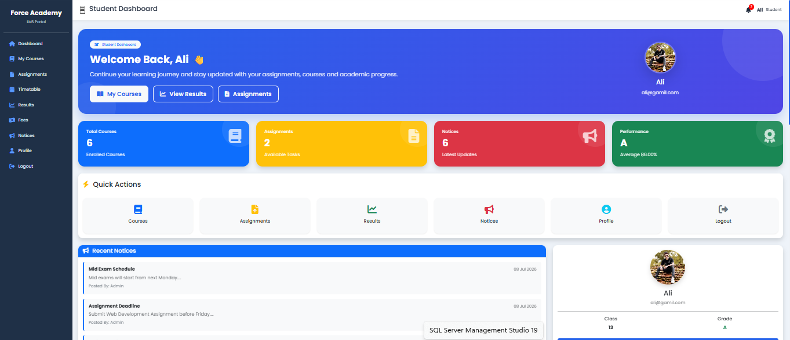
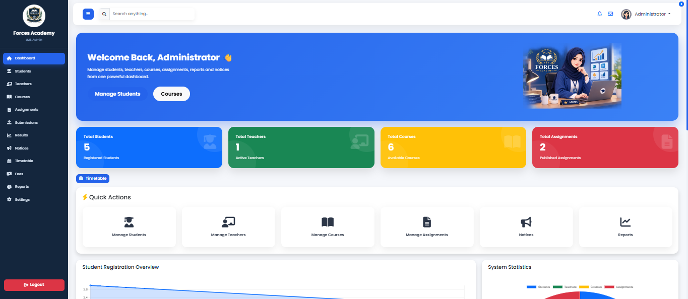
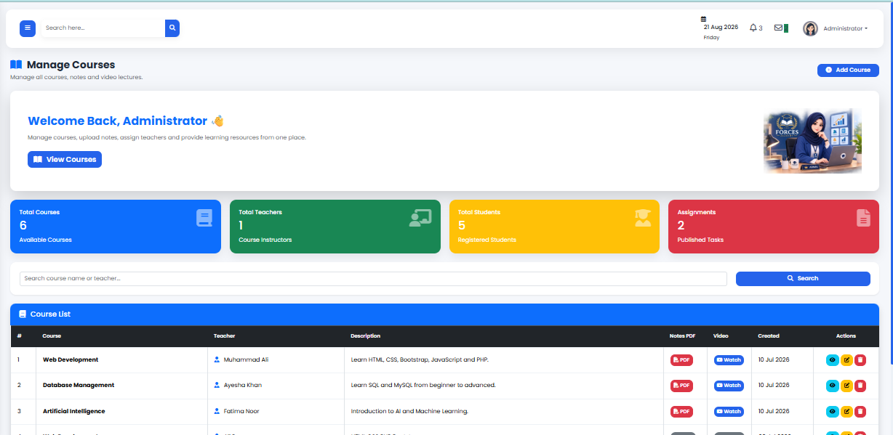
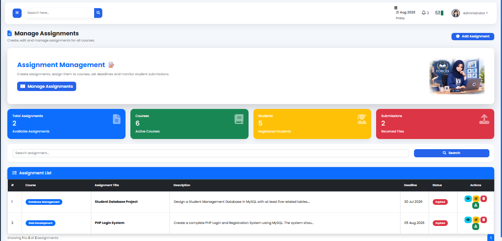

# Forces Academy LMS

## Project Description

A modern and responsive **web-based Learning Management System (LMS)** developed using **PHP, MySQL, HTML, CSS, Bootstrap, and JavaScript**.

The system provides separate portals for **Administrators and Students**, allowing efficient management of academic activities, students, teachers, courses, assignments, results, notices, timetables, fees, and more. This project provides separate portals for administrators and students to efficiently manage academic activities.

---

## 📌 Project Overview

Forces Academy LMS is designed to simplify academic and student management through a modern and user-friendly web interface.

The system allows administrators to manage students, teachers, courses, assignments, submissions, results, notices, timetables, and fees. Students can securely register and log in to access their personalized dashboard, courses, assignments, results, timetable, notices, profile, and fee records.

---
## 🚀 Live Demo

🔗 Live Website: https://forcesacademy23.infinityfreeapp.com

## ✨ Features

### 👨‍💼 Admin Panel
- Secure Admin Login
- Dashboard with statistics
- Add/Edit/Delete/View Student Details
- Manage Courses
- Manage Notices
- Manage Timetable
- Manage Teachers
- Manage Assignmets
- Admin Profile Management
- Manage Reports
- Manage Results
- Manage Timetable
- Manage Assignments Submissions
- Provide Feedback on Student Submissions
- Manage Student Fees
- Manage Settings
- Manage Reports
- Responsive Sidebar & Navbar
- Secure Logout

### 👨‍🎓 Student Portal
- Student Registration
- Secure Login & Logout
- Password Hashing
- Personalized Dashboard
- Profile Information
- Course Overview
- Timetable overview
- Assignments module
- Notice Board
- Dashboard Statistics
- Responsive User Interface
- Modern Bootstrap Design

---

## 🛠 Technologies Used

- PHP
- MySQL
- HTML5
- CSS3
- Chart.js
- Bootstrap 5
- JavaScript
- Font Awesome
- XAMPP

---
## 📁 Project Structure
forces-academy/
│
├── admin/              # Admin panel files
├── student/            # Student portal files
├── assets/             # CSS, JavaScript, and images
├── config/             # Database configuration
├── database/           # Database SQL file
├── screenshots/        # Project screenshots
├── index.php
└── README.md
## 📸 Project Screenshots

### 🎓 Student Dashboard

### 👨‍💼 Admin Dashboard

### 📚 Courses

### 📝 Assignments

### 🔐 User Roles
## 👨‍💼 Administrator

The administrator can manage:

- Students
- Teachers
- Courses
- Assignments
- Assignment Submissions
- Student Feedback
- Notices
- Results
- Timetable
- Fees
- Reports
- Settings

## 🎓 Student

Students can access:

- Dashboard
- Profile
- Courses
- Assignments
- Assignment Submission
- Timetable
- Results
- Notices
- Fees

### ⚙️ Installation and Setup
Clone or download this repository.
Move the project folder to the XAMPP htdocs directory.
Start Apache and MySQL from the XAMPP Control Panel.
Create a database in phpMyAdmin.
Import the provided SQL database file.
Update the database configuration in the config file.
Open the project in your browser using:
http://localhost/your-project-folder/

### 🎯 Learning Outcomes

Through this project, I gained practical experience in:

Full Stack Web Development
PHP and MySQL database integration
CRUD operations
User authentication and session management
Responsive web design
Debugging and testing
Git and GitHub version control
Live website deployment
## 🚀 Future Improvements

=- Online Quiz System
- Attendance Management
- Certificate Generation
- Email Notifications
---

## 👩‍💻 Developer

**Maryam Saif**

BS Information Technology (BSIT)

The University of Faisalabad

---
## 🙏 Acknowledgment

Special thanks to Code Saviours for providing the opportunity to work on this project during my Full Stack Web Development internship.

## 📄 License
This project is developed for educational and internship purposes.
--

⭐ If you found this project useful, consider giving it a star on GitHub.
